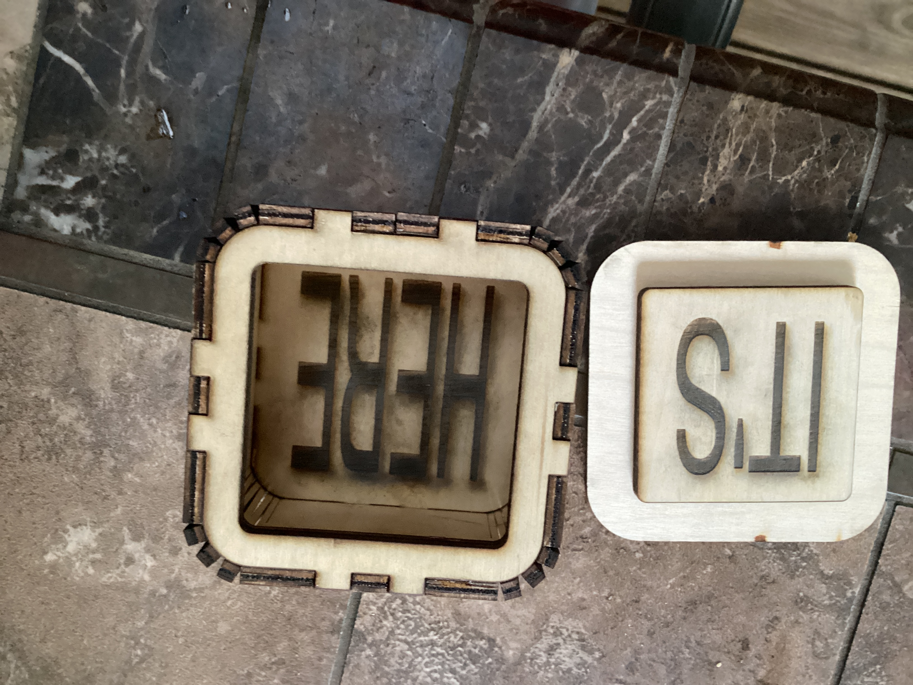

# Open source box  "Here it is"

!
!

## Build instructions

Make one for yourself or your friends!  Please record your work in the [manifest](./MANIFEST.md),
including any adjustments you made for materials, etc.

## Support files
* [Raw SVG](here-it-is.svg)
* [Line drawing](line-drawing.jpg)
* [QR code image](qr.png)
* [XCS](here-it-is.xcs)
* [Lightburn](./here-it-is.lbrn2)
